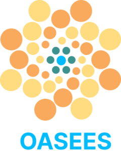

  

# OASEES Project

The OASEES project will deliver a European, fully open-source, decentralized, and secure Swarm programmability framework for edge devices and leveraging various AI/ML accelerators (FPGAs, SNNs, Quantum) while supporting a privacy-preserving Object ID federation process.

---

This project has received funding from the European Union’s HORIZON research and innovation programme under grant agreement No 101092702

  

